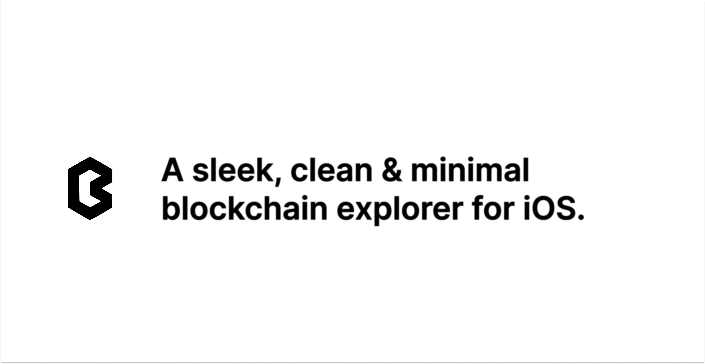

    
    

# Notice ‼️

This project has gone dormant. I plan to tackle this in the future. If you have any questions feel free to email me.
## Jump to:

-   [📡 Infrastructure](#-infrastructure)
-   [🔥 Contributing](#-contributing)
-   [👥 Contributors](#-contributors)
-   [✅ Code of Conduct](#-code-of-conduct)
-   [🎨 Designs](#-designss)
-   [🧰 Packages](#-packages)

## 📡 Infrastructure

You can checkout our documentation & configuration for our infrastructure [here](https://github.com/joinbeam/beam/blob/main/INFRASTRUCTURE.md).

## 🔥 Contributing

To contribute to Beam, checkout the [CONTRIBUTING.md file](https://github.com/joinbeam/beam/blob/main/CONTRIBUTING.md) for more detailed information on how to contribute.

## 🧰 Packages

Here is a breakdown of the mono repo.

| Name       | Package                                     |
| ---------- | ------------------------------------------- |
| Api        | [`packages/api`](packages/api)              |
| Landing    | [`packages/landing`](packages/landing/)     |
| GraphQL    | [`packages/graphql`](packages/graphql/)     |
| Types      | [`packages/types`](packages/types)          |
| Web        | [`packages/web`](packages/web)              |
| Blockchain | [`packages/blockchain`](packages/blockchain) |
| UI         | [`packages/ui`](packages/ui)                |
| Tsconfig   | [`packages/tsconfig`](packages/tsconfig)    |

## ✅ Code of Conduct

Before contributing responding to issues and or pull requests, Please read our [CODE_OF_CONDUCT.md file](https://github.com/joinbeam/beam/blob/main/CODE_OF_CONDUCT.md).

## 🎨 Designs

Beam's designs are 100% public for people to view on [Figma](https://www.figma.com/file/Fg4dD1yrJKmAh8i8Qd9Lum/Beam-App-Designs?node-id=19%3A43).

We have all website & landing page designs, mobile app designs, logos, etc on Figma.

If you have any questions or concerns about the designs, email me at andrewnijmeh1@gmail.com._
